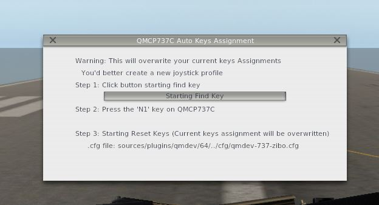
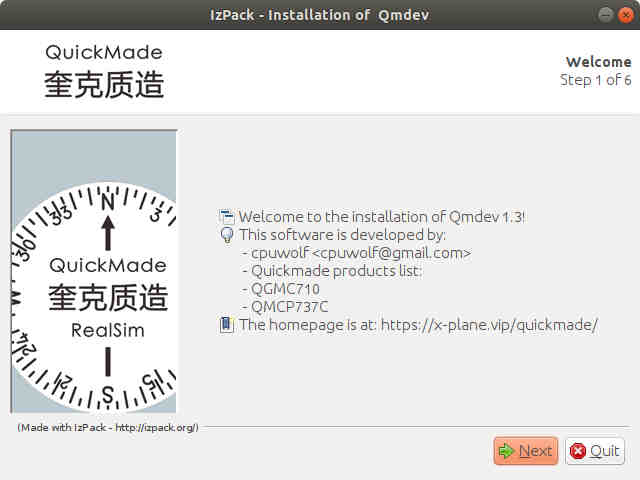
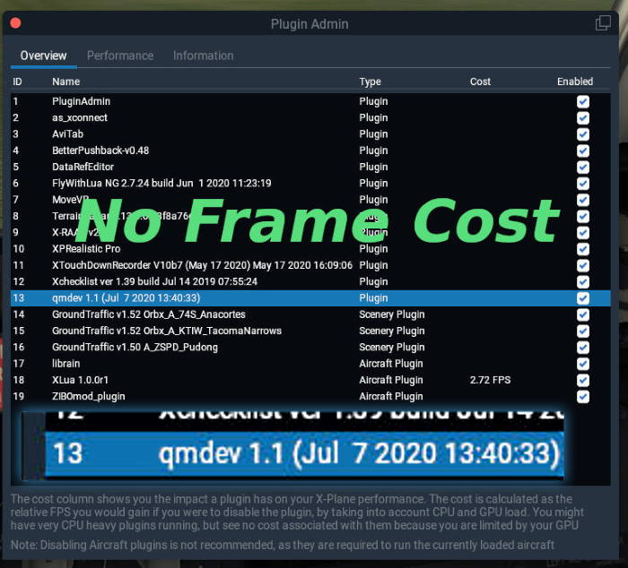

# Quickmadedevice

Quickmade devices USB HID handling plugin for X-Plane 11. It has great extensibility to add more aircrafts on your own.

its built-in Lua Language engine is easy for programming beginner

https://x-plane.vip/quickmade/

for MSFS2020 support

https://www.quickmadesim.com/ 

# Features

 * zero FPS impact
 * Lua language engine built-in
 * easy config files
 * easy debug: instant reload config file and lua files without restarting X-Plane

## Quickmade Products ##

### QGMC710

  * Hotstart TBM-900 v1.1.13
  * and General Aviation aircrafts
    https://www.youtube.com/embed/bnwsJ89BorU
 

### QMCP737C

   * ZIBO Boeing 738 3.51.7
   * Level-up Boeing 736/737/739
   * MAX team design 737MAX
   * IXEG 737 1.33
   * Flightfactor 757/767 v2.5.4
   * Flightfactor 777 1.9.15
   * Toliss A319/A321 v1.6.3
   * and General Aviation aricrafts
     https://www.youtube.com/embed/NRezZiCWqME

### QCDU B737/A320

   * ZIBO Boeing 738 3.51.7
   * Level-up Boeing 736/737/739
   * IXEG 737-300 1.33
   * Flightfactor 757/767 v2.5.4
   * Flightfactor 777 1.9.15
   * Flightfactor FF320
   * and General Aviation aircrafts
  
### QG1K PFD/MFD

  * hotstart TBM-900 v1.1.13
  * and General Aviation aircrafts with G1000
  
  
### QFCU

  * Flightfactor 320 v1.2.5 beta
  * Toliss A319/A321 v1.6.3
  * Toliss A340
  * JARDesign A330/A320

## Feature ##

* no framerate impact
* rotation acceleration
* joystick keys auto assignment

## Download

https://github.com/cpuwolf/Quickmadedevice/releases

## Install on Windows

installer is provided

Qmdev_setup.exe is for Windows user only

## Auto Key assignment (not a must)

starting from V4.0, auto key assignment is used to clear your native X-Plane 11 key assginment
under X-Plane plugin menu, you can find qmdev plugin, there will shows up a auto key assignment window, follow the window to automatically clear buttons

## More documents

https://github.com/cpuwolf/Quickmadedevice/wiki

## Screenshot ##

### Install on Linux/MacOS ##
java -jar Qmdev_Setup.jar

## Linux Manual Configuration ##

edit hidraw device access permission

sudo vim /etc/udev/rules.d/99-joysticks.rules

KERNEL=="event*", NAME="input/%k", MODE="0666", GROUP="input"

KERNEL=="hidraw*", SUBSYSTEM=="hidraw", MODE="0666", GROUP="input"

### Linux Kernel contribution ###
fix Linux Kernel joystick button max number limitation

https://patchwork.kernel.org/patch/11657985/

## Version Info ##
### V2.0 ###
optimize performance further more
add new keyword DFKEY to .cfg
add disfast dataref for temporarily disabling fast key
add QCDU, QG1K devices

### V5.0 ###
remove dependency of FlyWithLua, because Flywithlua costs fps, which cannot meet my expectation
introduce builtin ulua

## For Developers ##

How to write your own aircraft config file

https://github.com/cpuwolf/Quickmadedevice/wiki/Qmdev-.cfg-files

How to write your own .lua scripts file

https://github.com/cpuwolf/Quickmadedevice/wiki/Qmdev-.lua-files
