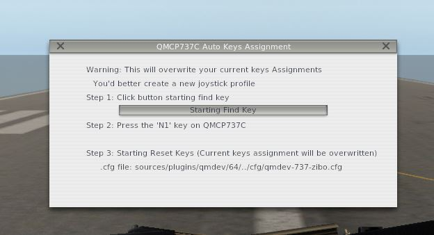
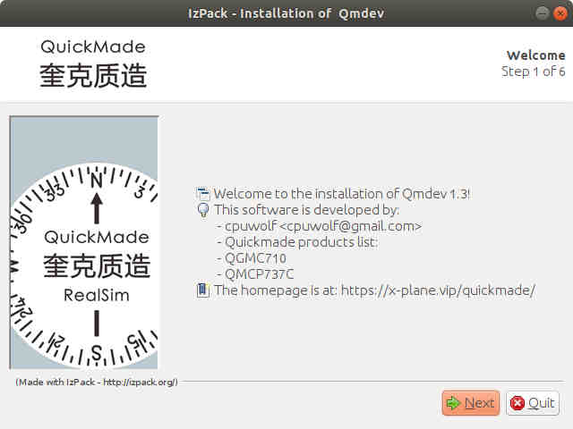

# Quickmadedevice

Quickmade devices USB hid handling plugin for X-Plane 11

https://x-plane.vip/quickmade/

## Quickmade Products ##

* QGMC710
* QMCP737C 

## feature ##

* no framerate impact
* rotation acceleration
* joystick keys auto assignment

## Download

https://github.com/cpuwolf/Quickmadedevice/releases

## Install

installer is provided

Qmdev_setup.exe is for Windows user only

Qmdev_setup.jar is for Windows/Linux/Mac users

## Auto Key assignment

under X-Plane plugin menu, you can find qmdev plugin, there is QMCP737C auto key assignment window, follow the window to automatically assign 104 buttons

## more documents

https://github.com/cpuwolf/Quickmadedevice/wiki

## Screenshot ##

## Linux ##

edit hidraw device access permission

sudo vim /etc/udev/rules.d/99-joysticks.rules

KERNEL=="event*", NAME="input/%k", MODE="0666", GROUP="input"

KERNEL=="hidraw*", SUBSYSTEM=="hidraw", MODE="0666", GROUP="input"

### Linux Installation ##
java -jar Qmdev_Setup.jar

### Linux Kernel contribution ###
fix Linux Kernel joystick button max number limitation

https://patchwork.kernel.org/patch/11657985/

